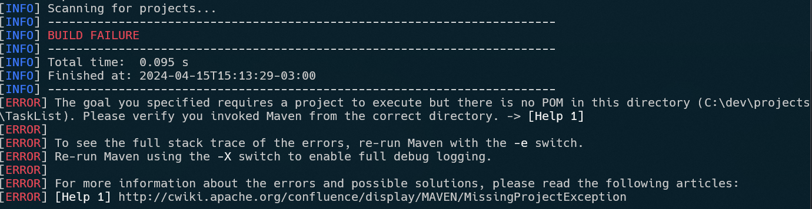

> Analisando o projeto de `Componente de Geolocalização`: https://github.com/CarlosMarques10/atvd-oo

```java
public Cep buscarCep(String numeracao) {
		Connection conn = Database.getConnection(); // Linha com problema
		try {
			String sql = "SELECT uf, cidade FROM faixas_cep WHERE ?::bigint BETWEEN CAST(cep_inicio AS bigint) AND CAST(cep_fim AS bigint) OFFSET 1LIMIT 1";
			
			PreparedStatement st = conn.prepareStatement(sql);
			st.setString(1, numeracao);
			
			ResultSet rs = st.executeQuery();
			
			if(rs.next()) {
				Cep cep = new Cep();
				cep.setUf(rs.getString("uf"));
				cep.setCidade(rs.getString("cidade"));
				cep.setNumeracao(numeracao);
				return cep;
			}
			
		} catch (SQLException e) {
			throw new DatabaseConnectionError(e.getMessage());
		} finally {
			Database.closeConnection(conn);
		}
		return null;
}
```
Neste exemplo, a conexão com o banco de dados é inicializada com o retorno do método. Porém, não é seguro, já que pode não haver sucesso na conexão.

```java
// Resolução
Connection conn = null;
try {
	conn = Database.getConnection();
	if (conn != null)
	{
		// ...
	} else {
		// ...
	}
}
```

Da forma acima, a SQLException do tipo DatabaseConnectionError é capturada.

No código a seguir, pergunta-se o CEP antes de se estabelecer a conexão, o ideal, entretanto, seria a aplicação indicar antes que não houve sucesso no seu estabelecimento.

```java
public class Main {
	public static void main(String[] args) {
		
		Scanner scan = new Scanner(System.in);
		
		System.out.println("Informe o CEP para busca: ");
		String numeracao = scan.nextLine();
		
		String response = ConsoleService.console(numeracao);
		System.out.println(response);
		
		scan.close();
		
	}
}
```

> Analisando o projeto de `Componente de Gerador de SQL`: https://github.com/DanielTM999/makerSql

O projeto foi analisado, porém sem necessidade de correções.

> Analisando o projeto de `Componente de Geração de Imagem`: https://github.com/silaspassos/ucsal-pooa-componente-imagem

No exemplo abaixo, o arquivo é escrito sem avisar ao usuário

```java
try {
	component.save(finalImage, "examples/output.png");
} catch (IOException e) {
	System.out.println(e.getMessage());
}
```

Esta seria uma alternativa que também armazena o path de escrita para reuso

```java
String outputPath = "examples/output.png";
try {
	component.save(finalImage, outputPath);
	System.out.println("Succesfully saved image on " + outputPath);
} catch (IOException e) {
	System.out.println(e.getMessage());
}
```

> Analisando o projeto de `Componente de tarefas assíncronas`: https://github.com/CauZy-Dev/TaskList/tree/main

> [!NOTE]
> Não foi encontrado o arquivo `pom.xml` no commit `c62536e`, portanto não foi possível executar o comando `mvn compile`, gerando o seguinte erro



O código abaixo faz uso de uma classe `Console` e a instancia. Ao o analisar, percebe-se que ela se encontra
no pacote `view`

```java
import view.Console;

//...

public static void main(String[] args) {
		Console console = new Console();
		console.console();
}
```

Acredito que um nome mais semântico tanto para a classe quanto para o método sejam `Menu` e `open`. Já que a classe não se trata de um Console real implementado e sim uma interface de texto sendo renderizada nele.

```java
import view.Menu;

//...

public static void main(String[] args) {
		Menu menu = new Menu();
		menu.open();
}
```

> Analisando o projeto de `Componente de Geração de Certificados`: https://github.com/armentanoc/CertificateGenerator
